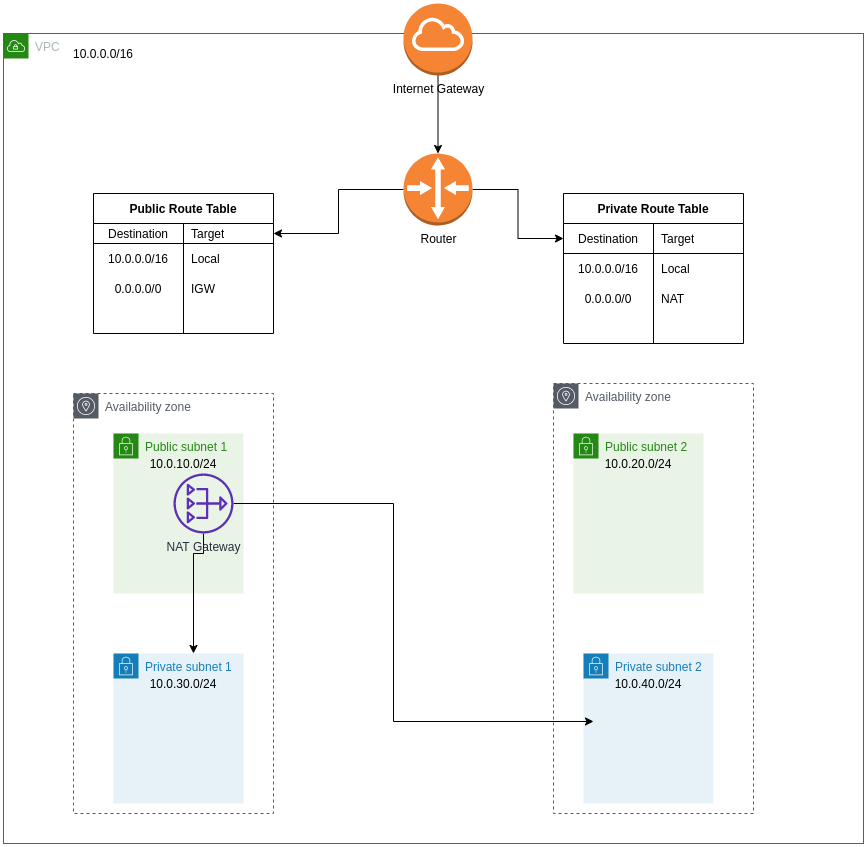

# AWS VPC using Terraform
This repo contain terraform module to create AWS VPC including two public subnets, two private subnets, NAT gateway, Public and Private route tables and their associations.

# Variables Declaration

All the variables are declared in [config](config) directory. You can change or update the values for each environment.

# Terraform Workspace

This code uses terraform workspaces so that you can create VPC for multiple environments e.g dev, stage, prod. To use terraform workspaces run following commands in the terminal
    terraform workspace list                    # this will list all workspaces
    terraform workspace select <workspace name> # this will select/switch mentioned workspace
    terraform workspace new <name>              # this will create new workspace

# Terraform Version
    Terraform => v0.13.5    

# Deploying Infrastructure

## Deploying Infrastructure for dev

Edit [config/dev.tfvars](config/dev.tfvars) file and replace variable values according to your environment then follow the steps below:

    terraform init
    terraform plan --var-file=config/dev.tfvars
    terraform apply --var-file=config/dev.tfvars

## Deploying Infrastructure for stage
----
Edit [config/stage.tfvars](config/stage.tfvars) file and replace variable values according to your environment then follow the steps below:

    terraform init
    terraform plan --var-file=config/stage.tfvars
    terraform apply --var-file=config/stage.tfvars

## Deploying Infrastructure for production

Edit [config/prod.tfvars](config/prod.tfvars) file and replace variable values according to your environment then follow the steps below:

    terraform init
    terraform plan --var-file=config/prod.tfvars
    terraform apply --var-file=config/prod.tfvars

## Deleting Infrastructure

    terraform destroy --var-file=config/<environment-file>.tfvars                 

# Archutecture Diagram

